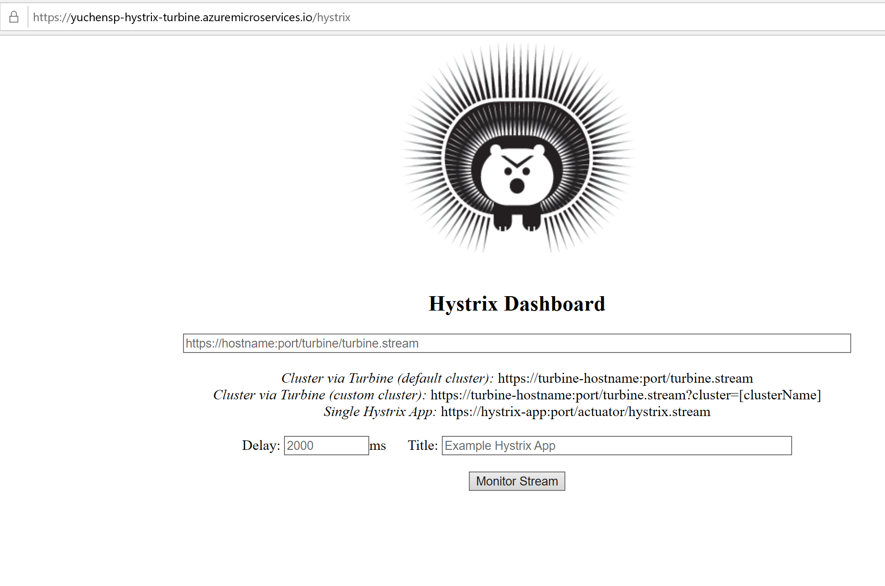

# Use Circuit Breaker Dashboard with Azure Spring Cloud
[Spring Cloud Netflix Turbine](https://github.com/Netflix/Turbine) is widely used to aggregates multiple [Hystrix](https://github.com/Netflix/Hystrix) metrics streams so that it can be monitored in a single view using Hystrix dashboard. In this tutorial, we will demonstrate how to use them on Azure Spring Cloud.

>[!NOTE] 
> Netflix Hystrix is widely used in many existing Spring Cloud apps but it is no longer in active development. If you are developing new project, you can consider using [resilience4j](https://github.com/resilience4j/resilience4j) instead. Circuit Breaker Dashboard for resilience4j dependents on micrometer, which is currently not supported for Azure Spring Cloud, thus will not be covered by this tutorial.

## Prepare your sample applications

Clone the sample repository to your develop environment. It is forked from [this repository](https://github.com/StackAbuse/spring-cloud/tree/master/spring-turbine), check out the original [blog](https://stackabuse.com/spring-cloud-turbine/) if you want to learn more.

```azurecli
git clone https://github.com/yucwan/spring-cloud.git
cd spring-cloud/spring-turbine
```

Build the 3 applications that will be used in this tutorial.
* user-service: A simple REST service that has a single endpoint of `/personalized/{id}`
* recommendation-service: A simple REST service that has a single endpoint of `/recommendations`, which will be called by user-service.
* hystrix-turbine: A Hystrix dashboard service to display Hystrix streams and a Turbine service aggregating Hystrix metrics stream from other services.
  
```azurecli
mvn clean package -D skipTests -f user-service/pom.xml
mvn clean package -D skipTests -f recommendation-service/pom.xml
mvn clean package -D skipTests -f hystrix-turbine/pom.xml
```

## Provision your Azure Spring Cloud instance

See: https://docs.microsoft.com/en-us/azure/spring-cloud/spring-cloud-quickstart-launch-app-cli#provision-a-service-instance-on-the-azure-cli

## Deploy your applications to Azure Spring Cloud

Be aware that our apps are not using Config Server, thus no need to config Config Server for Azure Spring Cloud before deployment.

```azurecli
az spring-cloud app create -n user-service --is-public
az spring-cloud app create -n recommendation-service
az spring-cloud app create -n hystrix-turbine --is-public

az spring-cloud app deploy -n user-service --jar-path user-service/target/user-service.jar
az spring-cloud app deploy -n recommendation-service --jar-path recommendation-service/target/recommendation-service.jar
az spring-cloud app deploy -n hystrix-turbine --jar-path hystrix-turbine/target/hystrix-turbine.jar
```

## Verify your apps

After all the apps are running and discovered, access `user-service` with the path `https://yuchensp-user-service.azuremicroservices.io/personalized/1` from your browser.

You should get the following output if `user-service` can access `recommendation-service`. Otherwise please try refreshing the web page a few times.

```json
[{"name":"Product1","description":"Description1","detailsLink":"link1"},{"name":"Product2","description":"Description2","detailsLink":"link3"},{"name":"Product3","description":"Description3","detailsLink":"link3"}]
```

## Access your Hystrix dashboard and metrics stream

### Using public endpoints

You can access `hystrix-turbine` with the path `https://<SERVICE-NAME>-hystrix-turbine.azuremicroservices.io/hystrix` from your browser, which shows the Hystrix dashboard running in this app.



Paste the Turbine stream url `https://<SERVICE-NAME>-hystrix-turbine.azuremicroservices.io/turbine.stream?cluster=default` and click Monitor Stream, and you will see the dashboard working. If you are not viewing anything, just hit the `user-service` endpoints to generate the streams.


You can now play with your Circuit Breaker Dashboard.

>[!NOTE] 
> Be aware that in production, the Hystrix dashboard and metrics stream should not be exposed to internet. 

### Using private test endpoints

Hystrix metrics streams are also accessible from test-endpoint. As a backend service, we didn't assign a public end-point for `recommendation-service`, let's show its metrics with test-endpoint at `https://primary:<KEY>@<SERVICE-NAME>.test.azuremicroservices.io/recommendation-service/default/actuator/hystrix.stream`.


As a web app, Hystrix dashboard should also be working on test endpoint. However, it is not working properly for two reasons: First, using test endpoint will change the base URL from `/` to `/<APP-NAME>/<DEPLOYMENT-NAME>`. Second, the web app is using absolute path for static resource. To get it worked on test endpoint, you might need to manually edit the `<base>`in the front-end files.